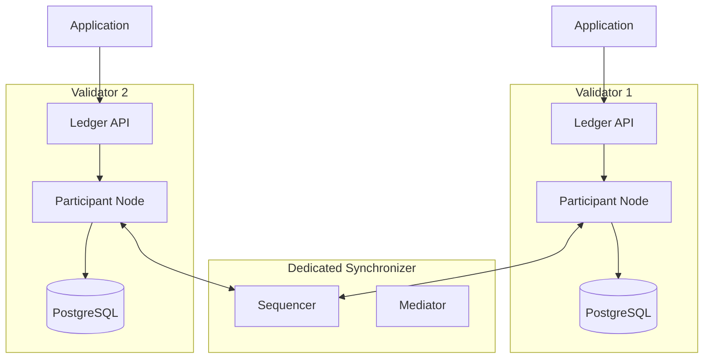

import CANTON_DOCS_CN_GS_EXTENSION_SYNCHRONIZERS_PRIVATE_VALIDATORS_0 from "/snippets/external/canton/main/docs-open/target/snippet_json_data/docs-cn/global-synchronizer-extension-synchronizers-private-validators-0.mdx";


You can run validators exclusively on a dedicated synchronizer, with no connection to the Global Synchronizer. However, a
dedicated synchronizer must have at least one validator that maintains a persistent connection to the Global Synchronizer for accounting and
settlement purposes. This connection is the mechanism by which fees are calculated and CC burn obligations are fulfilled. This logically gives
the users of a dedicated synchronizer that acts like a self-contained Canton deployment.

## When to choose private-only validators

Private-only validators suit specific operational scenarios:

- **Internal enterprise workflows** — Your Daml applications run entirely within one organization, and all parties are hosted on validators you operate.
- **Consortium with no external dependencies** — A closed group of organizations runs shared workflows without needing to perform transactions with the MainNet.
- **Regulatory constraints** — Rules prevent connecting to external network infrastructure, or all transaction processing must occur on infrastructure within a specific jurisdiction.
- **Development and testing** — You want to build and test Daml applications without setting up Global Synchronizer connectivity.

## What differs from Global Synchronizer validators

Running a validator without a Global Synchronizer connection simplifies operations but removes certain capabilities.

**What you get:**
- Full Canton protocol features — sub-transaction privacy, multi-party workflows, Daml smart contracts.
- The Ledger API works identically to a Global Synchronizer-connected validator.
- Simpler network topology for the synchronizer users.

**What you do not get:**
- No Canton Coin — You cannot hold, transfer, or use Canton Coin.
- No wallet connectivity by default — The wallet providers requires Global Synchronizer connectivity.
- No interoperability with Canton Network parties — Your contracts cannot interact with contracts on the Global Synchronizer.
- No validator onboarding process — You manage the full topology yourself.

## Architecture

A private-only validator is a standard validator connected to your dedicated synchronizer. Without the Global Synchronizer, the validator process (which handles Canton Network-specific features like wallet management and traffic purchases) is not needed.



## Deployment

Deploy the participant node without the validator process. You can use the Canton open-source distribution for this, since you do not need the Splice-specific components.

### Helm deployment

```yaml
# participant-values.yaml
participant:
  storage:
    type: postgres
    config:
      dataSourceClass: "org.postgresql.ds.PGSimpleDataSource"
      properties:
        serverName: "<postgres-host>"
        portNumber: 5432
        databaseName: "participant_db"
        user: "participant_user"
        password: "<password>"
  ledgerApi:
    port: 5001
    tls:
      certChainFile: "/certs/tls.crt"
      privateKeyFile: "/certs/tls.key"
  synchronizerConnections:
    - alias: "private-sync"
      sequencerConnection: "https://sequencer.private-sync.example.com"
```

```bash
helm install participant canton/canton-participant \
  -f participant-values.yaml \
  --namespace canton
```

### Connecting to the synchronizer

After the participant starts, it connects to the configured synchronizer automatically. Verify the connection:


<CANTON_DOCS_CN_GS_EXTENSION_SYNCHRONIZERS_PRIVATE_VALIDATORS_0 />


## Choosing between private-only and Global Synchronizer-connected

Use this decision framework:

- **Do any of your parties need to transact with external Canton Network parties?** If yes, you need  to transact on the Global Synchronizer. Consider the [hybrid pattern](/global-synchronizer/extension-synchronizers/hybrid-synchronizer-pattern) instead.
- **Do you need Canton Coin for payments or settlement?** If yes, you need a Global Synchronizer connection.
- **Might you need network connectivity in the future?** If possibly, deploy standard validators now and users can connect to the Global Synchronizer later. Adding a synchronizer connection is non-disruptive — see [linking to multiple synchronizers](/global-synchronizer/extension-synchronizers/linking-validator-multi-sync).

## Migrating to Global Synchronizer later

If your requirements change, the synchronizer users can connect your validators to the Global Synchronizer without disrupting your dedicated synchronizer workflows:

1. Complete the Global Synchronizer onboarding process (sponsorship, IP allowlisting, onboarding secret).
2. Add the Global Synchronizer connection to your validators.
3. As needed, reassign contracts that need network-wide visibility from the dedicated synchronizer to the Global Synchronizer.
4. Continue running private workflows on the dedicated synchronizer.

Your existing applications and contracts on the dedicated synchronizer are unaffected by adding the Global Synchronizer connection.
