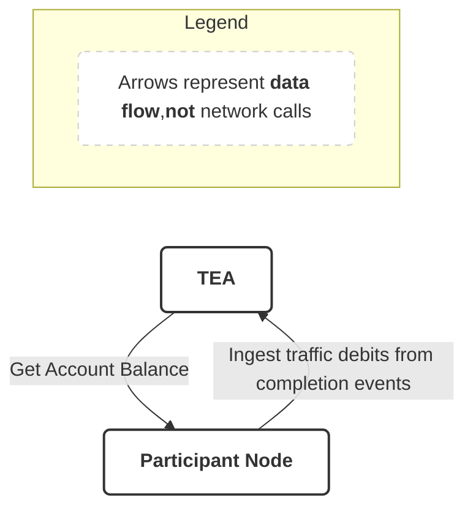
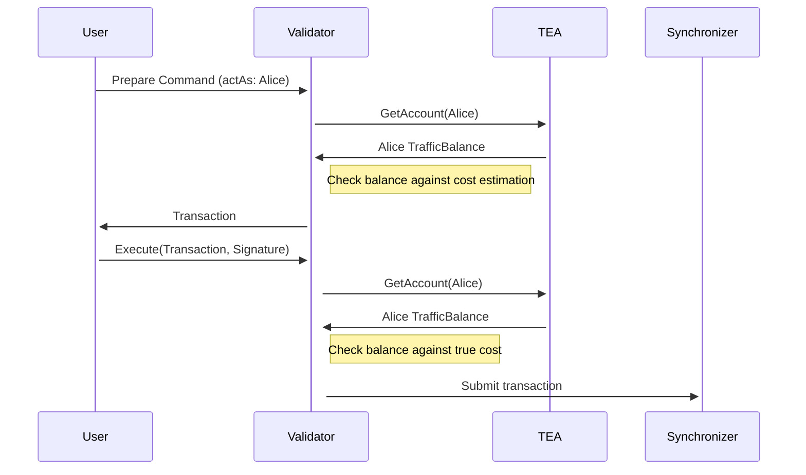

# Local Traffic Accounting

The validator provides an optional local traffic accounting feature, that allows participant operators to track the synchronizer traffic spent per transaction and tie it back to an account.
The account is implicitly tied to the (`actAs`) party that submitted the transaction.

The traffic that gets accounted for is the `paidTrafficCost` exposed on the [completion](/reference/grpc-ledger-api-reference/com-daml-ledger-api-v2/commandcompletionservice/completionstream#com-daml-ledger-api-v2-completion) events emitted on the Ledger API.
It corresponds to the cost that the node had to pay to the synchronizer to submit the transaction.

Note that the total traffic paid by the node is greater than the sum of the `paidTrafficCost` of all transactions, as the node also pays for other traffic.

The feature is implemented by the Traffic Enforcement App (TEA), built into the participant node. Its goal is to give
participant operators and wallet providers the means to tie the traffic spent by their node back to the user
submissions that triggered the spend, enabling accounting, monitoring and control of that spending.

## Configuration

Accounting and enforcement are two separate switches, both disabled by default:

```hocon
canton.participants.<participant_name>.traffic-enforcement {
  enabled = true                       # enables traffic accounting and exposes the TrafficService
  enforce-cost-on-submissions = true   # additionally enforces the cost against the account balance
}
```

Enabling accounting also exposes the `TrafficService` on the Ledger API. That service is what clients use to read and
credit traffic accounts, over gRPC or over the JSON API under `/v2/traffic/accounts`; it is documented in
[Traffic Accounting API](#traffic-accounting-api).

When `enabled` is false, the `TrafficService` is not exposed, no accounting is performed, and no
enforcement takes place. When `enabled` is true, accounting always happens; enforcement only happens if
`enforce-cost-on-submissions` is also true.

When enforcement is on, the balance of the submitting account is checked twice: in `prepare`, against the traffic cost
estimation, and in `execute`, against the exact cost. A failing check rejects the submission before it reaches the
synchronizer.

### Configuration reference

All settings live under `canton.participants.<participant_name>.traffic-enforcement`:

| Setting                                          | Default | Description                                                                                                                       |
| ------------------------------------------------ | ------- | --------------------------------------------------------------------------------------------------------------------------------- |
| `enabled`                                        | `false` | Enables traffic accounting and exposes the `TrafficService` on the Ledger API.                                                     |
| `enforce-cost-on-submissions`                    | `false` | Rejects submissions whose cost is not covered by the submitting account's balance.                                                 |
| `reject-multi-party-submissions`                 | `false` | Rejects submissions with more than one `actAs` party instead of letting them bypass accounting and enforcement.                    |
| `allow-submissions-on-degradation`               | `false` | Lets a submission through unchecked (logged at `WARN`) when the balance cannot be determined, for example during a database outage. |
| `traffic-enforcement-server.database-query-timeout` | `1s`    | Bounds the database read behind `GetAccount`. Must be at least one millisecond.                                                    |
| `traffic-enforcement-server.account-lookup-timeout` | `20s`   | Bounds the overall `GetAccount` call. Must be strictly larger than `database-query-timeout`, so that a timed-out query still leaves room for a retry. |

### Authentication

Access to the `TrafficService` requires `ExecuteAs` rights on the party to read an account balance, and
participant `Admin` rights to update an account.

### Which submissions are accounted for

An account is bound to a single party, so accounting and enforcement apply to submissions with exactly one `actAs`
party. This includes local parties. External submissions always have a single `actAs` party.

- **Multi-party submissions** cannot be attributed to an account and therefore bypass accounting and enforcement.
  Set `reject-multi-party-submissions = true` to reject them instead:

  ```hocon
  canton.participants.<participant_name>.traffic-enforcement {
    enabled = true
    reject-multi-party-submissions = true
  }
  ```

- **The participant admin party is exempt from enforcement**: its submissions are accounted for but not enforced, so node-internal
  activity does not need a funded account and cannot be blocked by an empty one.

### Submissions on degraded health

If the balance cannot be determined, for example during a database outage or when the lookup exceeds
`account-lookup-timeout`, the submission is rejected by default. Setting `allow-submissions-on-degradation = true`
lets it proceed unchecked instead, with a `WARN` log:

```hocon
canton.participants.<participant_name>.traffic-enforcement {
  enabled = true
  allow-submissions-on-degradation = true
  traffic-enforcement-server {
    database-query-timeout = "1s"
    account-lookup-timeout = "20s"
  }
}
```

The submission is still charged, so an account without enough traffic ends up with a negative balance until it is
topped up. This setting does not apply when the traffic service itself refuses the request: such submissions are
rejected regardless.

## Traffic Accounting API

The Ledger API exposes a service to interact with traffic accounts, available when
`traffic-enforcement.enabled = true`.

- [gRPC service](/reference/grpc-ledger-api-reference/com-digitalasset-canton-tea-v1)

The same service is also available on the JSON API.

### Update an account

```bash
curl -d '{ "accountId": "test", "balanceDelta": 100, "deduplicationId": "14be4101" }' \
  <ledger_http_json_api_endpoint>/v2/traffic/accounts

{"response":{"accountId":"test","balance":100}}
```

<Warning>
    `balanceDelta` is a **delta**, not an absolute balance. Use a negative value to subtract traffic.

    To avoid duplicated or retried requests being applied twice, set `deduplicationId` to a unique value for each
    distinct update request.
</Warning>

### Get an account

```bash
curl <ledger_http_json_api_endpoint>/v2/traffic/accounts/test

{"accountId":"test","balance":100}
```

### Console

The Canton console provides a set of commands to interact with traffic accounts:

```
participant.ledger_api.traffic.get_account("<partyId>")
participant.ledger_api.traffic.update_account("<partyId>", Some(1000), "<deduplicationId>")  # add 1000 traffic units
participant.ledger_api.traffic.update_account("<partyId>", Some(-1000), "<deduplicationId>") # subtract 1000 traffic units
```

## Observability

### Metrics

The traffic enforcement app exposes the following metrics, all prefixed by `daml.participant.traffic-enforcement.`:

| Metric name                  | Type      | Description                                                                                                                       |
| ---------------------------- | --------- | --------------------------------------------------------------------------------------------------------------------------------- |
| `decisions`                  | Counter   | The number of enforcement decisions, labeled by `traffic_enforcement_outcome` and, where applicable, `traffic_enforcement_reason`. |
| `enforcement-check-duration` | Histogram | The time taken to perform traffic enforcement checks, including balance lookups and decision making.                               |
| `projection-timestamp`       | Gauge     | The timestamp of the latest event consumed by the traffic enforcement projection.                                                  |
| `projection-offset`          | Gauge     | The latest saved offset of the traffic enforcement projection.                                                                     |

The `projection-timestamp` and `projection-offset` gauges are useful to monitor how far behind the traffic accounting
projection is compared to the Ledger API, since account balances only reflect events that have already been projected.

### Tracing

Trace context propagates across the in-process traffic service, so enforcement activity appears in the same trace as the
originating submission:

- `TrafficEnforcementBackend.validateTraffic` spans are emitted for enforcement decisions, with the outcome and an
  optional reason as attributes.
- `TeaProjectionHandler.applyDelta` spans are emitted when an applied projection delta is processed, with the
  corresponding event attributes.

## Runbook: rolling out traffic enforcement

1. **Enable accounting only** (`enabled = true`, `enforce-cost-on-submissions = false`) and observe the traffic spend
   attributed to each party, using the `GetAccount` API and the metrics below.

2. **Seed the traffic balance of your parties.** Accounts start at a zero balance and are only credited through the
   API, so every local party that submits transactions must be topped up before enforcement is switched on. The
   participant admin party is exempt and does not need to be seeded.

    ```bash
    curl -d '{ "accountId": "<partyId>", "balanceDelta": 100, "deduplicationId": "14be4101" }' \
      <ledger_http_json_api_endpoint>/v2/traffic/accounts
    ```

    Or from the console:

    ```
    participant1.ledger_api.traffic.update_account("<partyId>", Some(100), "seed-<partyId>")
    ```

3. **Decide how to treat the submissions that are not attributable to a single account**: keep the default (multi-party
   submissions bypass enforcement) or set `reject-multi-party-submissions = true`. Likewise, decide whether availability
   or strict enforcement matters more when the balance cannot be read, and set `allow-submissions-on-degradation`
   accordingly.

4. **Enable enforcement** (`enforce-cost-on-submissions = true`) once all accounts are funded.

<Warning>
    Enabling enforcement before seeding balances causes every submission from a party with a zero balance to be
    rejected.
</Warning>

## Behavior and limitations

- **Accounts are per-party and must be funded explicitly.** There is no initial or default balance, and no automatic
  top-up: balances are only credited through the `TrafficService`.
- **Only the traffic cost of Daml transaction submissions is attributed.** The total traffic the node pays to the
  synchronizer is higher than the sum of the accounted costs, because the node also pays for traffic that is not tied
  to a submission.
- **Only submissions with a single `actAs` party are attributable**, and the participant admin party is exempt. See
  [Which submissions are accounted for](#which-submissions-are-accounted-for).
- **Balances can go negative.** There is no reservation between the balance check and the actual charge, so concurrent
  submissions from the same party, or submissions let through by `allow-submissions-on-degradation`, can drive a
  balance below zero. The account stays negative until it is topped up.
- **Balances are updated as completions are processed.** A balance reflects the events the traffic projection has
  already consumed; the `projection-offset` and `projection-timestamp` metrics show how far behind it is.

## Implementation

The traffic enforcement app (TEA) is implemented as a built-in app on the validator node, that consumes the completion events emitted by the Ledger API and updates the account balances accordingly.
From this perspective it is no different from any other app that interacts with the Ledger API.

The following diagram illustrates the data flow between the TEA and the participant node:



<Note>
    A consequence of this design is that every accounted completion event results in a traffic debit, including when a
    single command produces several completions (for example a reject followed by an accept).
</Note>

The following is a sequence diagram illustrating the traffic enforcement checks performed by the validator during preparation of the transaction and before submitting it to the synchronizer:



In both checks, a failed balance check will result in the transaction being rejected.

